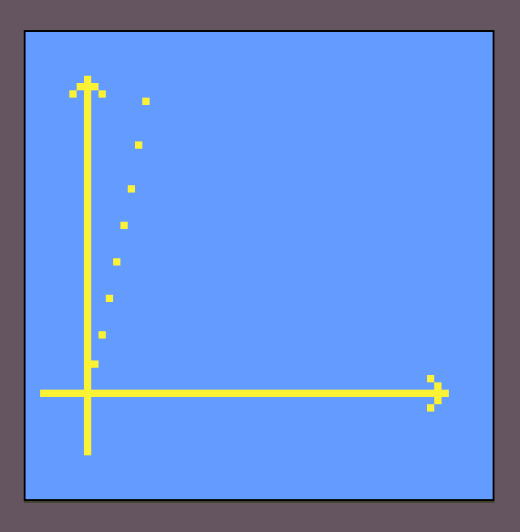

# 3D Fundamentals from Chili

> 关于基础的图形学和3D编程做一些学习总结

> 这些知识来自[Chili](https://wiki.planetchili.net/index.php/Main_Page)，有条件的朋友可以通过[Patreon](https://www.patreon.com/planetchili/posts)支持他

TODO

- [ ] 用latex写公式

## 起点 - 2D平面内的基础图形绘制

### 线性代数

对于向量、矩阵等概念有基本的了解即可

### 直线的绘制


在平面解析几何中，直线常用如下斜截式表示：

```
y = kx + b
```

然而，在2D图形绘制的过程中，更常见的需求是过两点（p1, p2）画一条直线（严格来讲是线段，不过我并不追求严谨的数学论证，后文依然使用直线）。显然，我们可以这样操作：

```
k = ( y1 - y2 ) / ( x1 - x2 )
b = y1 - kx1
```

如此，依然可以得到直线方程`y = kx + b`，接下来就是直线的绘制：

```cpp
// 屏幕上所有像素的坐标都是整数，因为我们无法绘制半个像素
// 但是抽象的2D平面内，点的坐标并不局限于整数
void DrawLine(float x1, float x2, float k, float b)
{
    assert(x1 <= x2);

    int xStart = int(x1);
    int xEnd = int(x2);

    for (int x = xStart; x < xEnd; x++)
    {
        int y = int(k * x + b);
        PutPixel(x, y);
    }
}
```

这样就结束了吗？

以第一象限为例，当`0 <= k <= 1`时，绘制效果是正确的。然而，当`k -> 正无穷`时，每一次`x++`会导致y的变化值（dy）很大，使得我们绘制的直线非常“稀疏”，如下：



因此，当`k -> 正无穷`时，我们应该用y作为循环变量进行直线的绘制，使得直线上的点更加密集。相信聪明的你一定可以写出对应的代码（提示：绝对值）。

### 转换、缩放和平移

### 点乘与碰撞检测

### 三角函数与旋转

### 矩阵乘法
